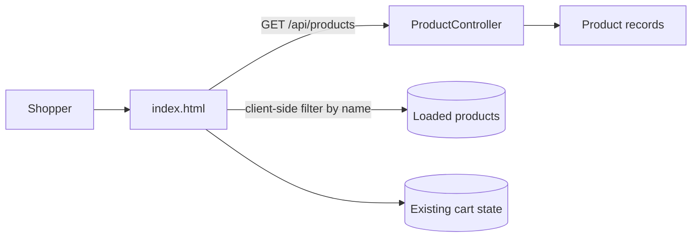
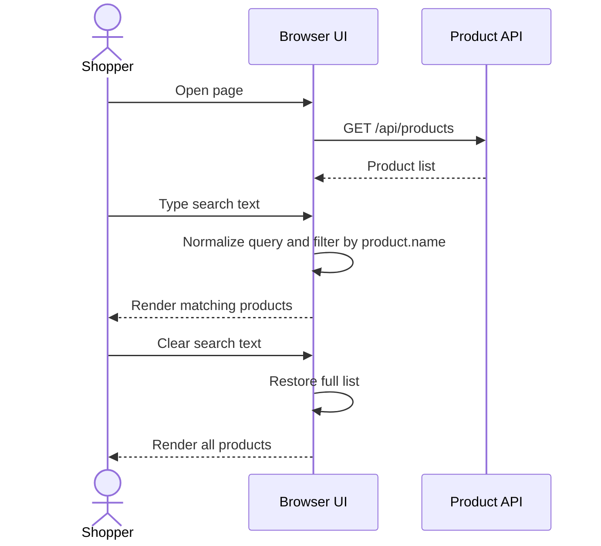

# Architecture: Product Name Search

## 1. Current Code Structure

The application is a minimal Spring Boot web app with a static browser UI.

- `src/main/java/com/example/shop/Application.java` boots the Spring Boot application.
- `src/main/java/com/example/shop/controller/ProductController.java` exposes `GET /api/products` and returns the product catalog as an in-memory list.
- `src/main/java/com/example/shop/model/Product.java` defines the product shape used by the API and UI.
- `src/main/resources/static/index.html` serves the entire UI, fetches products from the API, and renders product cards and cart actions in client-side JavaScript.

## 2. Solution Overview

The search feature will be implemented entirely on the client side in `index.html`.
The page already fetches the full product list from `GET /api/products`, so the browser can filter that in-memory collection without adding new backend endpoints.

Search behavior:

- Render a visible search box above the product grid.
- Store the loaded products in browser state.
- On each input change, normalize the query and filter by `product.name`.
- Re-render the product grid using the filtered list.
- When the query is empty, show all products again.

## 3. Components and Responsibilities

### Backend

| Component | Responsibility |
| --- | --- |
| `Application` | Starts the Spring Boot app. |
| `ProductController` | Serves the product catalog through `GET /api/products`. |
| `Product` | Carries product data to the client. |

### Frontend

| Component | Responsibility |
| --- | --- |
| Search box | Captures the shopper's query as they type. |
| Product state | Keeps the loaded catalog and the current filtered list in memory. |
| Filter function | Applies case-insensitive name matching. |
| Render function | Rebuilds the product grid from the filtered list. |
| No-results state | Shows feedback when no products match. |

## 4. Data Flow

1. Browser loads `index.html`.
2. Page calls `GET /api/products`.
3. API returns the product list as JSON.
4. Frontend stores the list in memory.
5. Shopper types into the search box.
6. Frontend lowercases and trims the query, then filters `product.name`.
7. Frontend re-renders the product cards.
8. If the query is empty, the full list is rendered again.

## 5. API Contract

### Existing endpoint

`GET /api/products`

Response: JSON array of `Product` objects.

`Product` fields:

| Field | Type | Purpose |
| --- | --- | --- |
| `id` | number | Unique identifier for cart actions. |
| `name` | string | Search target and display name. |
| `price` | number | Displayed on the product card. |
| `image` | string | Emoji/icon shown in the card. |

### Search contract

No backend API change is required. Search is a browser-side filter over the fetched catalog.

## 6. Error Handling

- If the product fetch fails, the UI should show a readable error state instead of an empty grid.
- If the search query matches no products, the UI should show a no-results message.
- Empty or whitespace-only input should be treated as an empty search and restore all products.
- Search should not mutate the original loaded catalog.

## 7. Testing Strategy

### Manual checks

- Confirm the search box is visible on page load.
- Type a full product name and verify only matching cards remain.
- Type mixed-case text and verify matching is case-insensitive.
- Clear the search box and confirm all products return.
- Enter a query with no matches and confirm the no-results state appears.

### Automated checks

- Add unit coverage for the name-filtering logic if the filtering is extracted into a function.
- Add UI/browser coverage for typing, clearing, and empty-result behavior if the project adds frontend test tooling later.

## 8. Mermaid Diagrams

### Component Diagram

### Search Sequence Diagram

## 9. Notes

- The current cart flow remains unchanged.
- Search stays local to the browser, which keeps the feature simple and responsive for the existing demo application.
