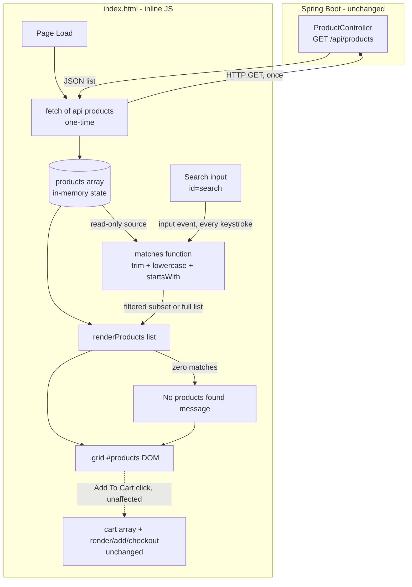

# Architecture: Product Search Box

## Source Requirements

- `src/docs/requirements.md` (Jira EPMCDMETST-62766) — approved.
- Scope: client-side, case-insensitive **prefix** search over the already-loaded product catalog, instant (no debounce) filtering, "No products found" empty state, no new backend endpoint, no automated tests in this story.

## 1. Existing System Overview

The application is a minimal Spring Boot 3.3.5 (Java 17+, Maven) storefront demo:

- **Backend**
  - `com.example.shop.model.Product` — POJO with `id`, `name`, `price`, `image`.
  - `com.example.shop.controller.ProductController` — exposes `GET /api/products`, returning a hardcoded in-memory `List<Product>`. No persistence layer, no other endpoints.
  - `com.example.shop.Application` — standard Spring Boot bootstrap class.
- **Frontend**
  - Single static page: `src/main/resources/static/index.html`.
  - Plain HTML/CSS/inline `<script>` — no framework, no build step, no bundler.
  - On page load, `fetch('/api/products')` populates a module-level `products` array once; `products.map(...)` renders `.card` elements into `#products` (the `.grid` container).
  - `cart` array and `render()` handle cart state independent of the product grid; `add(id)` and `checkout()` are the only other behaviors.

This story adds a search box that filters what is rendered into `#products`. It does **not** touch `ProductController`, `Product`, or any Java code.

## 2. Why No Backend/API Changes Are Needed

- The full catalog is already fetched once via `GET /api/products` on page load (assumption A1, FR6, AC9). It is small and static (hardcoded list), so client-side filtering has no meaningful performance cost (assumption A2).
- FR3 requires only a **prefix** match on the `name` field — a pure string operation (`toLowerCase().startsWith(...)`) that needs no server computation, indexing, or query capability.
- NFR2 / AC9 explicitly forbid any new network request triggered by typing.
- Out of Scope section explicitly excludes server-side search.
- Therefore all new logic lives entirely in `index.html`'s inline `<script>`; `ProductController` and `Product` remain unchanged, and no new DTOs/endpoints are introduced (A7).

## 3. DOM Structure Changes in `index.html`

A search `<input>` is added **above** `.grid` (FR1, clarifying Q6), inside the same left column `<div>` that currently wraps `.grid`:

```html
<div>
  <input type="text" id="search" placeholder="Search products by name..." />
  <div class="grid" id="products"></div>
</div>
```

- Styling follows existing inline CSS conventions already declared in the `<style>` block (A8) — e.g., a simple rule such as:
  `#search{width:100%;padding:10px;margin:0 0 14px;border-radius:10px;border:1px solid #ccc;box-sizing:border-box}`
  No new CSS framework is introduced (NFR3).
- A placeholder element (or conditional text) for the empty state is rendered **inside** `#products` when there are zero matches, rather than as a separate DOM node, so no extra containers need to be wired into the layout grid (see §5).

## 4. Client-Side State Management

Today, `products` is the single source of truth and is rendered directly and unconditionally at fetch time. This story introduces a second, derived state:

| State | Description | Lifetime |
|---|---|---|
| `products` | Full, unfiltered catalog array, populated once by `fetch('/api/products')` on load. Unchanged in content/order thereafter (FR6, A5). | Set once at load; read-only afterward. |
| (derived) filtered list | Computed on every `input` event by filtering `products` against the current trimmed, lowercased search term. Not persisted — recomputed fresh each keystroke from `products`. | Ephemeral per render call. |

No new global mutable array needs to be introduced for the filtered list — it is computed inline as a local `const` inside the input handler and passed straight to the render function (see §6). This avoids a second piece of state going out of sync with `products`, and matches AC5 (clearing search must restore the *original* `products` order untouched).

The `cart` array and its `render()`/`add()`/`checkout()` functions are entirely independent of this new state and are not modified (FR7, NFR4, AC10).

## 5. Prefix-Match Algorithm (FR3, AC1–AC8)

```
function matches(product, rawTerm):
    term = rawTerm.trim().toLowerCase()
    if term == "":
        return true                      // no filter -> show all (A5, AC5, AC6)
    return product.name.toLowerCase().startsWith(term)   // prefix only, case-insensitive (AC1, AC2, AC7, AC8)
```

- **Trim**: leading/trailing whitespace stripped before comparison (AC7); whitespace-only input reduces to `""` and is treated as "no filter" (AC6).
- **Case-insensitivity**: both sides lowercased before comparison (AC8).
- **Prefix only**: `String.prototype.startsWith` — never `.includes()` — so mid-string matches are excluded by design (AC2). This is the only matching mode implemented; no fallback to substring search.
- Matching is performed only against `product.name`; `price`/`image`/`id` are not considered (clarifying Q3), since `Product` has no `description`/`category` field.

**Empty-state rendering (FR4, AC4):** if the computed filtered array's length is `0` **and** the trimmed term is non-empty, the render function writes a "No products found" message into `#products` instead of card markup. If the term is empty, the full list is always rendered (never triggers the empty-state message), satisfying AC5/AC6.

> **Note (added post-design-review):** `renderProducts(list)` itself (see §6) only checks `list.length`, not whether the search term is empty — this is intentional and equivalent in practice, because when the term is empty the filter is a no-op (`matches` returns `true` for every product), so `list` is always the full, non-empty `products` catalog (per A1/A2, the catalog is never empty). The empty-state message therefore only ever appears in the "non-empty term, zero matches" case described above. If the backend catalog itself were ever empty, `renderProducts([])` would show "No products found" even with an empty search term — this is an accepted, out-of-scope edge case since the current catalog is hardcoded and always non-empty.

## 6. Refactor of the Rendering Logic

Currently, rendering is inlined directly in the `fetch(...).then(...)` callback:

```js
fetch('/api/products').then(r=>r.json()).then(d=>{
  products=d;
  document.getElementById('products').innerHTML = d.map(p=>`...card html...`).join('');
});
```

This duplicates the "build card HTML" logic if search needs to re-render later. The refactor extracts a single reusable function, e.g. `renderProducts(list)`, that both the initial load and the search handler call:

```js
function renderProducts(list) {
  const el = document.getElementById('products');
  el.innerHTML = list.length
    ? list.map(p => `<div class=card><div class=emoji>${p.image}</div><h3>${p.name}</h3><p>₹${p.price}</p><button onclick=add(${p.id})>Add To Cart</button></div>`).join('')
    : '<p>No products found</p>';
}
```

- The card-template string moves out of the `fetch` callback and into `renderProducts`, called once as `renderProducts(products)` after fetch completes, and again on every `input` event with the filtered subset.
- This is a pure refactor of *how* rendering is invoked — the generated card markup, the `add(id)` wiring, and cart behavior are byte-for-byte identical to today's output (FR7, NFR4, AC10). No duplication of the card-template markup is introduced.
- No changes to `add()`, `render()` (cart rendering — distinct function, unfortunately similarly named but unrelated to `renderProducts`), or `checkout()`.

## 7. Event Wiring (FR2, AC3)

```js
document.getElementById('search').addEventListener('input', () => {
  const term = document.getElementById('search').value;
  renderProducts(products.filter(p => matches(p, term)));
});
```

- Bound to the native `input` event (fires on every keystroke, paste, and delete) — not `keyup`/`change`, ensuring instant feedback with no missed edits.
- **No debounce/throttle** wrapper of any kind is added around this handler (NFR1, AC3, Out of Scope) — the filter executes synchronously inline on the same call stack as the event.
- The handler reads `products` (already in memory) and never calls `fetch` again (FR6, NFR2, AC9).

## 8. Component Diagram

Since this story introduces no new backend components, the diagram focuses on the frontend module interactions within `index.html`, showing the one-time fetch versus the repeated client-side filter/render cycle.



- The `fetch` → `ProductController` edge occurs exactly once, on page load, exactly as today.
- The `Search` → `Filter` → `Render` loop runs entirely client-side, on every keystroke, with no edge back to the backend — visually confirming NFR2/AC9.
- `Cart` remains a sibling subsystem, only ever invoked via existing `add(id)` clicks on rendered cards, regardless of whether the grid is filtered.

## 9. Non-Functional Considerations (as scoped by requirements)

- **No debounce (NFR1/AC3):** filtering is synchronous per keystroke; explicitly not implementing any `setTimeout`/`requestAnimationFrame` batching.
- **No new network calls (NFR2/AC9):** filtering reuses the in-memory `products` array; `fetch` is called exactly once, at load.
- **No new frameworks/build tooling (NFR3):** implementation stays within the existing single-file plain HTML/CSS/JS approach; no npm/bundler/framework introduced.
- **Performance (A2):** given the hardcoded, small in-memory catalog, a full `Array.prototype.filter` + `startsWith` scan on every keystroke is O(n) over a small n and has no perceptible latency; no indexing/memoization is warranted.
- **Accessibility (NFR5):** explicitly out of scope; no ARIA roles, labels, or keyboard-navigation guarantees are part of this design.
- **Cart integrity (NFR4/AC10):** `cart`, `render()` (cart rendering), `add()`, and `checkout()` are untouched; only the `#products` grid's visible subset changes based on search.

## 10. Explicitly Out of Scope (carried from requirements)

- Server-side search endpoint or query parameter on `GET /api/products`.
- Debounce/throttle of the search input.
- Substring/contains matching, fuzzy/typo-tolerant matching, or matched-text highlighting.
- Matching on `description`/`category` (fields do not exist on `Product`).
- Accessibility enhancements (ARIA, keyboard nav guarantees, screen-reader announcements).
- Automated test authoring (unit/integration/UI) — deferred to a later phase.
- Pagination, sorting, search history/persistence.

## 11. Summary of File-Level Impact

| File | Change |
|---|---|
| `src/main/resources/static/index.html` | Add `#search` input above `.grid`; add `#search`-related CSS rule; extract/refactor card-rendering into a reusable `renderProducts(list)` function used both at load and on every `input` event; add `matches(product, term)` prefix-match helper; wire `input` event listener. |
| `com.example.shop.model.Product` | No change. |
| `com.example.shop.controller.ProductController` | No change. |
| `com.example.shop.Application` | No change. |

No new files, endpoints, DTOs, or dependencies are introduced by this architecture.
