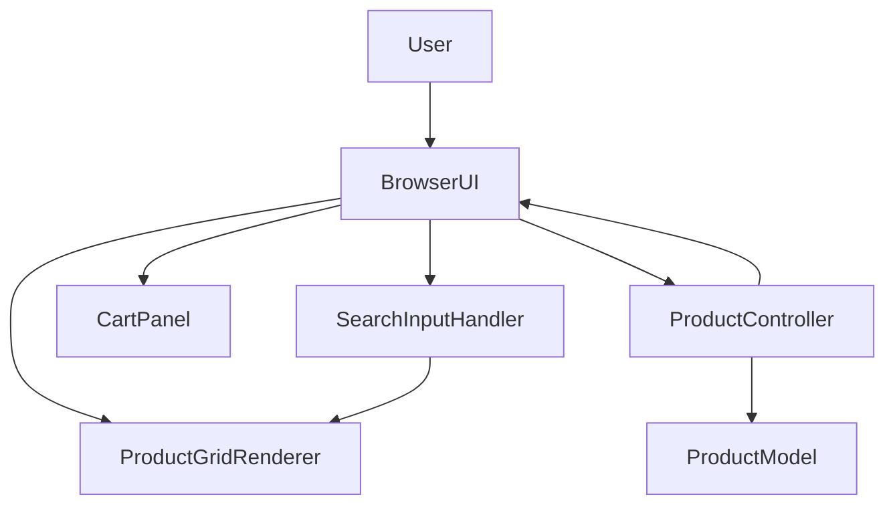

# Architecture: Product Search by Name

## 1. Overview

This application is a small Spring Boot storefront that serves a static browser UI and a REST product catalog. The product search requirement is implemented entirely on the client side against the product list already loaded into the browser, so no new backend or database layer is required.

## 2. Architecture Analysis

### Application type
- Single-page style storefront UI served by Spring Boot static resources
- REST backend exposing a product catalog
- Client-side filtering for immediate search feedback

### System boundaries
- **In scope:** product catalog retrieval, storefront rendering, client-side search/filtering, cart display
- **Out of scope:** backend search, persistence, authentication, advanced catalog features

### External dependencies
- Spring Boot Web for HTTP serving and REST endpoints
- Browser DOM APIs and native JavaScript
- Maven for build and packaging

## 3. Requirements Traceability

The architecture supports these key requirements:
- Search box visible on the product listing page
- Immediate filtering while typing
- Case-insensitive prefix matching on product name only
- Empty or whitespace-only input resets the list
- No-results empty state when nothing matches
- Original product order is preserved

## 4. Components

### 4.1 Browser Storefront UI
**Purpose:** Render the shopping cart experience in the browser.

**Responsibilities:**
- Load the product catalog from `/api/products`
- Render product cards, cart contents, totals, and empty state
- Capture search input and update the visible product list immediately
- Keep filtering limited to the loaded in-memory product array

**Interactions:**
- Calls the product API once during page load
- Filters the in-memory list on each input event

### 4.2 Search Input Handler
**Purpose:** Convert user keystrokes into filtered product results.

**Responsibilities:**
- Normalize whitespace
- Perform case-insensitive prefix matching on product names
- Preserve the original array order
- Trigger empty state rendering when no matches remain

**Interactions:**
- Reads from the loaded product list
- Updates the product grid in the DOM

### 4.3 Product Grid Renderer
**Purpose:** Display the matching products.

**Responsibilities:**
- Render product cards in a responsive layout
- Show all products when the search is empty
- Show a no-results message when the filtered set is empty
- Render product content through safe DOM APIs rather than unsafe HTML injection

**Interactions:**
- Receives filtered products from the search handler

### 4.4 Cart Panel
**Purpose:** Display cart items and the running total.

**Responsibilities:**
- Render selected items
- Update total when items are added or checkout clears the cart

**Interactions:**
- Uses the loaded product objects already in memory

### 4.5 Spring Boot Application
**Purpose:** Host the web application and REST endpoint.

**Responsibilities:**
- Start the HTTP server
- Serve the static storefront assets
- Expose `/api/products`

**Interactions:**
- Returns the product catalog to the browser

### 4.6 Product Controller
**Purpose:** Provide the product list API.

**Responsibilities:**
- Return the catalog as JSON
- Keep product data ordered and deterministic

**Interactions:**
- Supplies the initial catalog consumed by the frontend

### 4.7 Product Model
**Purpose:** Define the product data shape.

**Responsibilities:**
- Represent product id, name, price, and image/emoji

**Interactions:**
- Serialized by Spring Boot as JSON

## 5. Technology Recommendations

| Layer | Technology | Why |
|---|---|---|
| Frontend | HTML, CSS, Vanilla JavaScript | Matches the current repo, keeps filtering immediate, and avoids extra framework overhead |
| Backend | Spring Boot 3.3.5 + Spring Web | Already in use, simple REST serving, minimal operational complexity |
| Database | None | Search is client-side over already loaded data; persistence is not required |
| Testing | Playwright UI tests | Best fit for search behavior, keyboard interaction, and empty-state rendering |
| Build Tools | Maven | Matches the existing project structure and Spring Boot setup |

## 6. Data Flow

1. The user opens the product listing page.
2. The browser loads the static storefront and requests `/api/products`.
3. The Spring Boot controller returns the product catalog as JSON.
4. The browser stores the products in memory and renders the initial grid.
5. The user types in the search box.
6. The input handler normalizes the text and filters the in-memory list by case-insensitive name prefix.
7. The renderer updates the product grid immediately.
8. If no products match, the renderer shows the empty state message.
9. Cart actions continue to use the same loaded product list.

## 7. Security Considerations

- No user input is sent to the server for search, which reduces server-side attack surface.
- Client-side filtering should treat input as plain text and avoid unsafe HTML injection when rendering results.
- The API exposes only a fixed product catalog, so there is no persistence or query injection surface in scope.

## 8. Performance Considerations

- Filtering in memory keeps search latency low and satisfies the immediate-update requirement.
- The catalog is small, so a simple linear prefix filter is sufficient.
- Preserving the original list order avoids extra sorting work.

## 9. Scalability and Extensibility

- The current design is optimized for a small catalog and fast UI iteration.
- If the catalog grows substantially, the search logic can be moved behind a dedicated backend search endpoint without changing the storefront layout.
- The product model is already isolated enough to support additional fields later.

## 10. Mermaid Component Diagram

