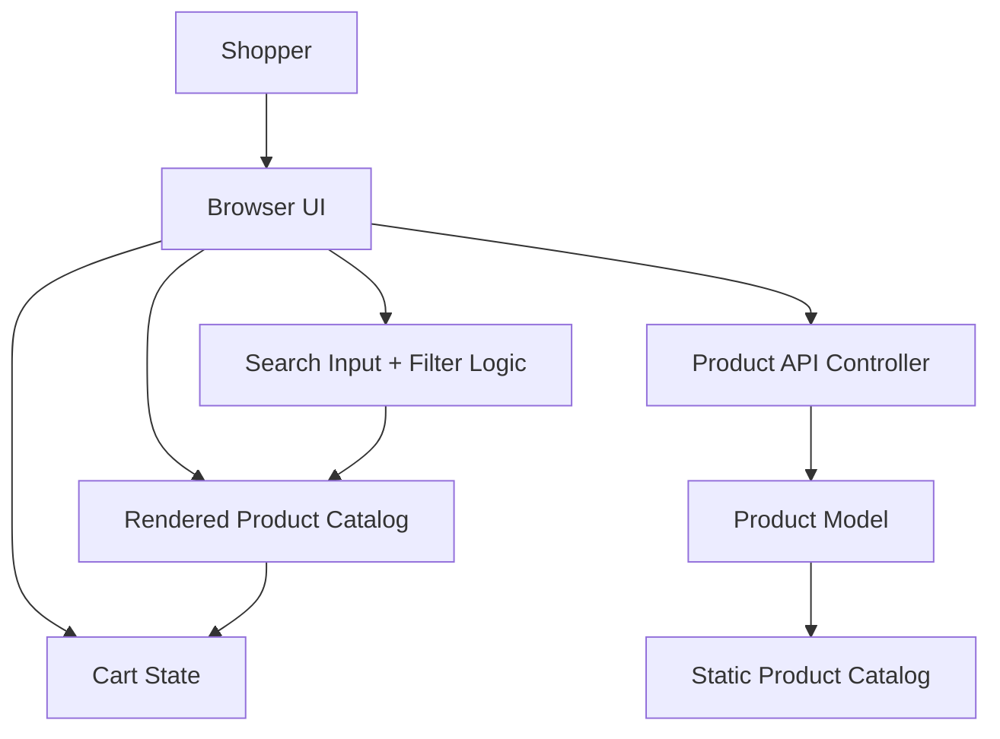

# Architecture: Product Search by Name

## 1. Overview
This application is a lightweight Spring Boot storefront that serves a product catalog over a REST endpoint and renders a modern storefront in the browser using static HTML, CSS, and JavaScript. The current requirement adds a client-side product search experience in which the shopper can type a product name and immediately reduce the displayed catalog to matching products.

The architecture is intentionally simple and aligned to the existing codebase: a minimal backend exposes product data, and the front end manages user interaction and filtering logic. This keeps the implementation low-complexity while satisfying the requirements for immediate search, case-insensitive matching, and empty search reset behavior.

## 2. Requirements Traceability
From `requirements.md`:
- Search box is visible on the product listing page.
- Product list filters as the shopper types.
- Search is case-insensitive.
- Empty search restores the complete product list.
- Search scope is limited to product names only.

These requirements map directly to a UI-level filtering layer without introducing a separate search service, database indexing, or backend search API.

## 3. Architectural Approach
### 3.1 Application Type
- Single-page storefront with a thin Spring Boot backend
- Server-side render is not required; the UI is assembled in the browser
- Product data is lightweight and loaded from a REST API once at page load

### 3.2 Key Architectural Decisions
1. Frontend-first search behavior
   - Search logic is implemented in browser-side JavaScript using the in-memory product array.
   - This matches the requirement that filtering is immediate and does not require server-side API changes.

2. Minimal backend surface
   - Backend exposes `GET /api/products` and returns a static catalog list.
   - No new persistence layer or backend search endpoint is needed for this feature.

3. Product name-only matching
   - Search compares only the `name` property of each product.
   - This intentionally excludes descriptions, categories, and other metadata.

4. Case-insensitive comparison
   - Filtering uses normalized lowercase values for both input and product names, ensuring consistent behavior regardless of casing.

5. Empty search reset
   - When the input value is blank, the UI re-renders the full catalog.

## 4. Components and Responsibilities
### Component: Browser UI
Responsibilities:
- Render the storefront layout and product cards
- Display the search input field
- Capture shopper text input
- Filter the product list and update the visible UI in real time
- Maintain cart interactions and totals

### Component: Product API Controller
Responsibilities:
- Expose product catalog data to the browser
- Return the list of available products in JSON format
- Remain independent from UI search logic

### Component: Product Model
Responsibilities:
- Represent a product as a stable record with identifier, name, price, and image
- Provide data needed by both the UI and the cart logic

### Component: In-Browser Product State
Responsibilities:
- Store the loaded catalog in memory
- Apply search filter logic to the product array
- Re-render the filtered list whenever the input changes

## 5. Proposed Technology Choices
### Frontend
- HTML/CSS/JavaScript
- Reason: This repository already uses a static storefront and the requirement is UI-focused; no additional frontend framework is required.

### Backend
- Spring Boot 3.3.5 with Java 17
- Reason: Existing application already uses this stack; it is sufficient for exposing a lightweight REST API.

### Build and Packaging
- Maven
- Reason: Already configured in the repository and matches the existing Spring Boot application.

### Testing
- Playwright
- Reason: The repository already lists Playwright as a supported UI testing tool; it is suitable for validating the visible search box and filtering behavior.

## 6. Data Flow
1. The shopper opens the storefront page.
2. The browser issues a `GET /api/products` request to the backend.
3. The `ProductController` returns the list of products as JSON.
4. The front-end stores the product list in memory and renders product cards.
5. The shopper enters text into the search input.
6. The UI normalizes the value and filters the in-memory product array by `product.name`.
7. Matching products remain visible; non-matching products are hidden.
8. If the input is empty, the UI re-displays the full catalog.
9. The shopper may continue adding items to the cart without affecting the product search behavior.

## 7. Component Diagram

## 8. Quality Attributes and Constraints
### Performance
- Product catalog size is expected to remain modest; a client-side array filter is sufficient.
- Search updates should feel immediate because filtering is done in memory.

### Reliability
- The feature has no complex persistence or asynchronous processing; failure modes are limited to UI rendering and data retrieval.

### Security
- No user authentication or sensitive data is involved in this requirement.
- Input is treated as user text and only used for local filtering; no direct injection into backend logic occurs.

### Maintainability
- The application remains simple and easy to understand due to minimal component boundaries.
- Future enhancements such as server-side filtering or category search can be added without reshaping the overall architecture.

## 9. Risks and Trade-offs
- Client-side filtering is efficient for the current dataset but does not scale to large product catalogs or complex search requirements.
- The architecture deliberately avoids server-side search APIs because the requirement is limited to a simple UI filter and does not require database-backed search or indexing.
- Product-name-only matching is intentionally narrow and avoids scope creep beyond the approved story.

## 10. Architecture Summary
The system is a thin, browser-driven storefront with a minimal backend contract. Search is handled entirely in the client by filtering the loaded product list based on product name and case-insensitive matching, which satisfies the story while preserving a simple and maintainable architecture consistent with the repository’s current design.
